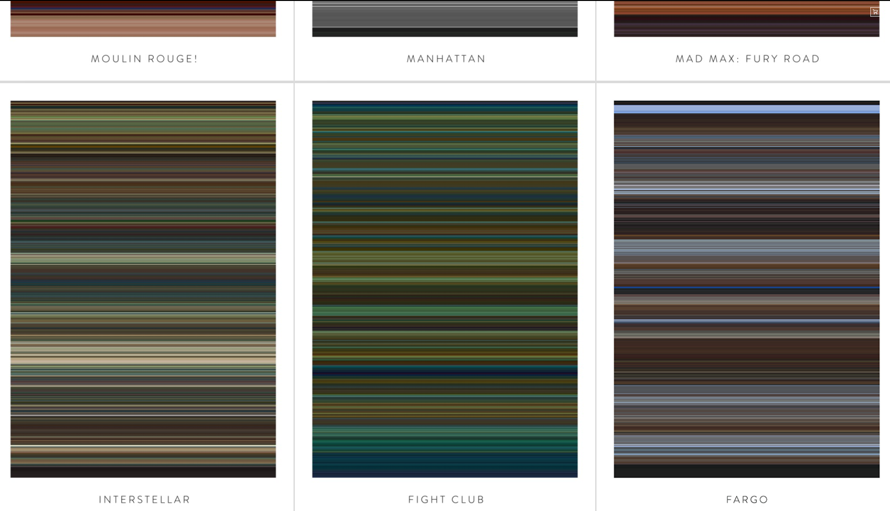

[](https://cran.r-project.org/package=spongecake)
[](https://cran.r-project.org/package=spongecake)


# spongecake

Transform a Movie into a Synthetic Picture. A frame every 10 seconds is summarized into one colour, then every generated colors are stacked together. 

why doing this ?... why not ?! :-)





## Installation


```R
# from CRAN
install.packages("spongecake")


# from Github
if (!require(devtools)){install.packages("devtools")}
devtools::install_github("ThinkRstat/spongecake")
```


## Usage
```R
library(spongecake)
library(magrittr)
#options(ffmpeg = "C:/ffmpeg-3.1.4-win64-static/bin/ffmpeg.exe") # windows user
library(magrittr)
gen_screenshot(movie = "D:/mymovie.avi") %>%
draw()
```


totally inspired from <http://thecolorsofmotion.com/films>
